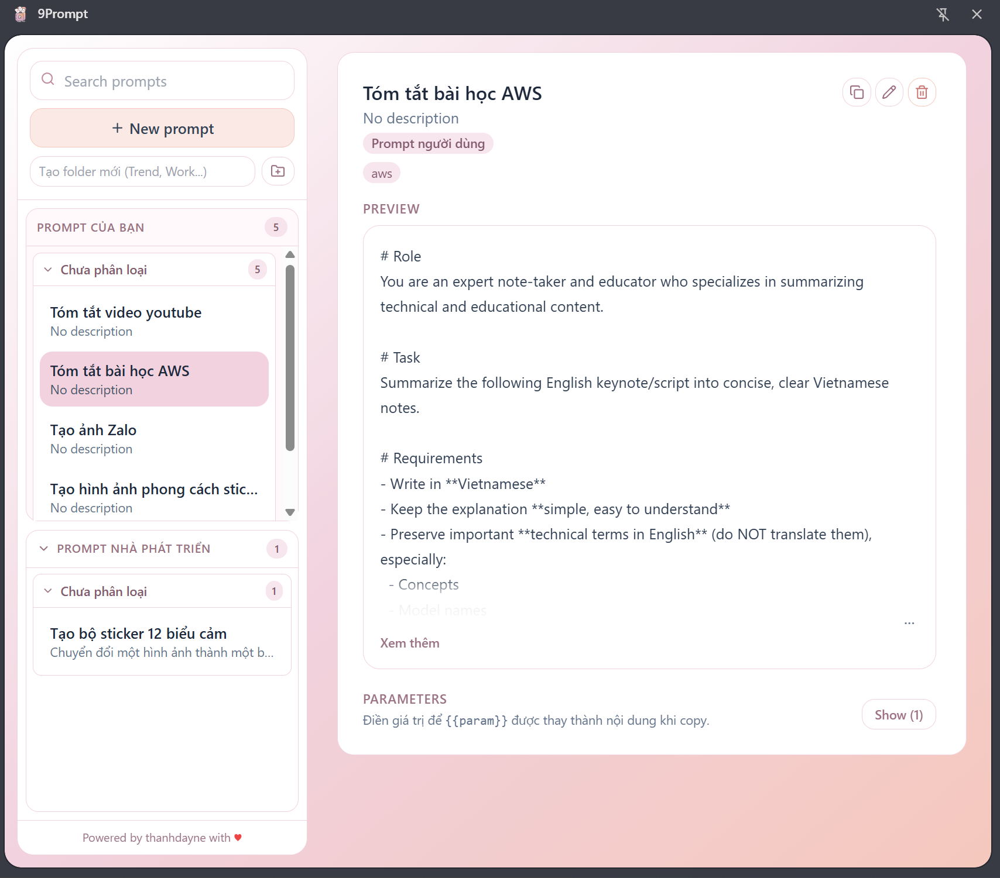

# 9Prompt Chrome Extension



Minimal Chrome Extension (Manifest V3) for saving and reusing AI prompts.

## Stack

- React + TypeScript + Vite
- Zustand for state
- TailwindCSS for styling
- `chrome.storage.local` for persistence (with `localStorage` fallback in normal web dev mode)

## Features

- Create, edit, delete, duplicate prompts
- Search by title, content, description, and tags
- Parameter highlighting for `{{variable_name}}` placeholders
- Inline parameter explanation via hover tooltip
- Local-first storage (no backend)

## Developer Prompt Source

- Built-in developer prompts are loaded from `public/developer-prompts.json`
- To add/update templates, edit that JSON file directly, then rebuild and publish
- User-created prompts are stored locally in `chrome.storage.local`

## Run locally

```bash
npm install
npm run dev
